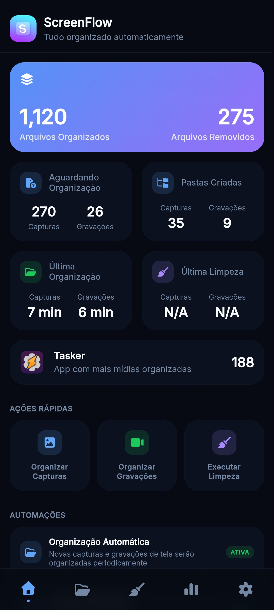

# Tagly

Organizador automático de capturas e gravações de tela para Android — agrupa mídias por aplicativo de origem e automatiza a limpeza de arquivos antigos com regras configuráveis por pasta e tipo de mídia.

<br>

<div align="center">
  <p>
    
    
    
    
  </p>
</div>

---

## Demonstração

<div align="center">
  
</div>

---

## Funcionalidades

### Dashboard

- Painel principal com métricas em tempo real: arquivos organizados, removidos e itens pendentes
- Indicador do aplicativo com maior número de mídias organizadas
- Ações rápidas para organizar capturas, gravações ou executar limpeza manualmente
- Controles de automação com status em tempo real (ativa/inativa)
- Feed de atividades recentes com histórico das últimas operações

### Organizador

- Visualização em grade das pastas agrupadas por pacote de aplicativo
- Filtros por tipo de mídia: todas, capturas de tela ou gravações
- Busca por nome de aplicativo com debounce
- Menu de contexto por pasta com opção de limpeza individual
- Paginação infinita via `IntersectionObserver` para listas grandes
- Contador de arquivos por tipo em cada pasta

### Limpeza Automática

- Regras de exclusão automática configuráveis por pasta e por tipo de mídia
- Prazo de retenção (dias) definido individualmente por tipo dentro de cada pasta
- Toggle de automação com limpeza agendada
- Execução manual com feedback de progresso

### Estatísticas

- Gráficos semanais de atividade com Chart.js
- Alternância entre visualização de capturas de tela e gravações
- Ranking das pastas com mais arquivos organizados por tipo de mídia

### Configurações

- Tema claro, escuro ou automático (seguindo o sistema)
- Idioma: Português, Inglês e Espanhol
- Controle de notificações (organização, limpeza, arquivos pendentes)
- Habilitar/desabilitar animações de interface
- Destino personalizado para os arquivos organizados
- Reset de configurações e exclusão de todos os dados

---

## Tecnologias Utilizadas

| Tecnologia                     | Uso                                      |
| ------------------------------ | ---------------------------------------- |
| Vanilla JavaScript (ES6+)      | Toda a lógica de UI e negócio            |
| CSS Custom Properties          | Theming e variáveis de design            |
| Chart.js                       | Gráficos de atividade semanal            |
| POSIX Shell (`/system/bin/sh`) | Operações no sistema de arquivos Android |
| Tasker API (`tk.*`)            | Integração com automações do Android     |
| Inter (Google Fonts)           | Tipografia                               |
| Eruda                          | Console de desenvolvimento mobile        |
| GitHub Actions + Gemini API    | CI/CD e geração de changelog             |

---

## Pré-requisitos

- Dispositivo Android com o aplicativo **[Tasker](https://tasker.joaoapps.com/)** instalado
- Permissão de acesso ao armazenamento concedida ao Tasker
- Para desenvolvimento local: qualquer navegador moderno com suporte a ES6+

---

## Instalação

### Produção (via Tasker)

1. Baixe o arquivo XML da [última release](../../releases/latest)
2. Abra o Tasker e importe o arquivo XML do projeto
3. Conceda as permissões necessárias (acesso ao armazenamento)
4. Execute a tarefa principal para abrir o Tagly

### Desenvolvimento local

1. Clone o repositório:
   ```bash
   git clone https://github.com/seu-usuario/tagly.git
   cd tagly
   ```
2. Abra o arquivo `index.html` diretamente em qualquer navegador

> Não são necessários bundlers, transpiladores ou instalação de dependências — o projeto roda como HTML/JS/CSS puro.

---

## Como Usar

### Em produção

Após importar o projeto no Tasker, execute a tarefa principal **Tagly** para abrir a interface. As automações de organização e limpeza são acionadas automaticamente conforme as regras configuradas.

### Em desenvolvimento

Abra `index.html` no navegador. O sistema detecta automaticamente a ausência do `tk` global e ativa o **modo Web**, onde:

- Dados são lidos/escritos no `localStorage` com o prefixo `@tagly:`
- Operações de arquivo são simuladas pelo `MockEnv` com dados de exemplo
- Toda a interface funciona normalmente sem o Tasker

---

## Configuração

O Tagly não usa variáveis de ambiente externas. Todas as configurações são gerenciadas dentro da própria interface, na aba **Configurações**, e persistidas via `AppState`.

### Camada de Ambiente (ENV)

A abstração `ENV` resolve automaticamente o ambiente de execução:

| Operação            | Modo Web (desenvolvimento) | Modo Tasker (produção)          |
| ------------------- | -------------------------- | ------------------------------- |
| Leitura de dados    | `localStorage`             | Arquivos JSON via `tk.shell()`  |
| Escrita de dados    | `localStorage`             | Arquivos JSON via `tk.shell()`  |
| Execução de tarefas | Mock local (`MockEnv`)     | `tk.performTask()`              |
| Ícones de apps      | Pasta `src/assets/icons/`  | `content://` provider do Tasker |
| Idioma do sistema   | `navigator.language`       | `%system_language` do Tasker    |

---

## Estrutura do Projeto

O projeto segue uma arquitetura **MVC por funcionalidade** — cada tela é composta por arquivos `model`, `view` e `controller`. Todos os módulos são encapsulados em **IIFEs**, sem uso de bundlers ou transpiladores.

```
Tagly/
├── index.html                        # Entry point da aplicação
├── src/
│   ├── app.js                        # Inicialização e bootstrap da aplicação
│   ├── core/
│   │   ├── env.js                    # Abstração de ambiente (Web / Tasker)
│   │   ├── app-state.js              # Estado global centralizado
│   │   ├── event-bus.js              # Sistema de eventos pub/sub
│   │   ├── navigation.js             # Roteamento entre abas com lazy-init
│   │   ├── pagination.js             # PaginationManager com IntersectionObserver
│   │   ├── task-queue.js             # Fila de tarefas assíncronas para o Tasker
│   │   ├── process-engine.js         # Motor de pipelines de processos
│   │   ├── i18n.js                   # Internacionalização com interpolação e plurais
│   │   ├── icons.js                  # Resolução dinâmica de ícones
│   │   ├── logger.js                 # Logger com níveis (debug, info, warn, error)
│   │   ├── dialog-stack.js           # Gerenciamento de pilha de diálogos
│   │   ├── scroll.js                 # Controle de scroll
│   │   ├── app-monitor.js            # Monitor de estado do aplicativo
│   │   └── subfolder-monitor.js      # Monitoramento de subpastas
│   ├── features/
│   │   ├── dashboard/                # Painel principal
│   │   │   └── process/              # Motor de processos da dashboard
│   │   │       ├── process.config.js # Definição dos pipelines de processo
│   │   │       ├── script.sh         # Script Shell para operações no sistema de arquivos
│   │   │       └── ...
│   │   ├── organizer/                # Módulo de organização de mídias
│   │   ├── cleaner/                  # Módulo de limpeza automática
│   │   ├── stats/                    # Módulo de estatísticas
│   │   └── settings/                 # Módulo de configurações
│   ├── lib/                          # Utilitários e helpers compartilhados
│   ├── i18n/                         # Arquivos de tradução (pt, en, es)
│   └── assets/
│       ├── styles/                   # CSS modular com custom properties
│       └── icons/                    # Ícones de aplicativos Android
├── tasker/
│   └── auto-process/                 # Runner para automações agendadas do Tasker
└── .github/
    ├── workflows/release.yml         # Pipeline de release com changelog via Gemini AI
    └── templates/release-notes.md    # Template para notas de versão
```

---

## Tasker / Automação

### Tarefas Principais

| Tarefa                 | Descrição                                        |
| ---------------------- | ------------------------------------------------ |
| `Tagly`           | Abre a interface principal                       |
| `Organize Screenshots` | Varre e organiza capturas de tela                |
| `Organize Recordings`  | Varre e organiza gravações de tela               |
| `Auto Clean`           | Executa limpeza com base nas regras configuradas |
| `Auto Process`         | Runner geral de automação agendada               |

### Lógica de Negócio — Motor de Processos

As operações são executadas como **pipelines de passos** definidos em `process.config.js`. Cada passo pode ser:

- **`type: "shell"`** — Executa um comando no `script.sh` via Tasker
- **`type: "js"`** — Executa uma função JavaScript com os dados do contexto anterior

Exemplo do pipeline `organize_screenshots`:

```
1. scan_screenshots    → Shell: varre a pasta de origem e coleta pacotes de apps
2. resolve_app_names   → JS: resolve nomes amigáveis dos pacotes
3. create_app_folders  → Shell: cria as pastas de destino
4. prepare_file_moves  → JS: prepara os comandos de movimentação
5. move_and_count      → Shell: move os arquivos e conta o resultado
6. save_summary        → JS: persiste o resumo e registra a atividade
```

O backend de cada pipeline é o `script.sh`, que executa operações no sistema de arquivos via `tk.shell()` e retorna sempre JSON padronizado:

```json
{ "success": true, "data": ..., "error": null }
```

Comandos disponíveis no script:

| Comando                    | Descrição                                         |
| -------------------------- | ------------------------------------------------- |
| `scan_media_app_packages`  | Varre pasta e coleta pacotes de apps por extensão |
| `count_media_items`        | Conta arquivos de mídia numa pasta                |
| `create_app_media_folders` | Cria pastas de destino por app                    |
| `run_batch_command`        | Executa movimentação em lote e retorna contagem   |
| `find_expired_files`       | Localiza arquivos mais antigos que N dias         |
| `delete_files_batch`       | Exclui lista de arquivos em lote                  |
| `delete_folder_contents`   | Esvazia uma pasta                                 |
| `get_subfolders`           | Lista subpastas com timestamps                    |
| `get_item_counts_batch`    | Conta itens em múltiplas pastas de uma vez        |
| `rename_folder`            | Renomeia (ou mescla) uma pasta                    |
| `read_file` / `write_file` | Leitura e escrita de arquivos JSON                |

### Importando via Taskernet

> Link do projeto no Taskernet em breve.

1. Acesse o link da Taskernet (disponível nas releases)
2. Confirme a importação no Tasker
3. Siga as instruções de permissão na tela

---

## Contribuição

Contribuições são bem-vindas! Para contribuir:

1. Fork o repositório
2. Crie uma branch para sua feature: `git checkout -b feat/minha-feature`
3. Faça commit das suas alterações: `git commit -m 'feat: descrição da feature'`
4. Push para a branch: `git push origin feat/minha-feature`
5. Abra um Pull Request

Por favor, siga o padrão de commits [Conventional Commits](https://www.conventionalcommits.org/).

> O release é automatizado via **GitHub Actions**: ao criar uma tag `v*`, o workflow coleta os commits, usa a **API do Gemini** para gerar um changelog legível e publica a release com o XML do projeto Tasker anexado.

---

## Licença

Distribuído sob a licença **MIT**. Veja o arquivo [`LICENSE`](./LICENSE) para mais detalhes.
